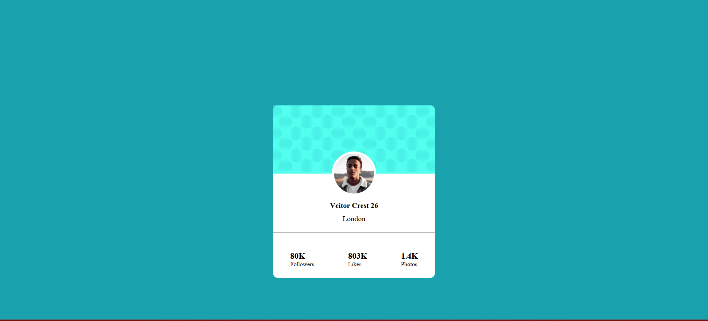

### დავალება: "CSS Positions" - დიზაინის იმპლემენტაცია

**აღწერა:**
ააწყვეთ მოცემული დიზაინი HTML/CSS-ის გამოყენებით. მთავარი მიზანია სუფთა და ვალიდური კოდის წერა, რომელიც ვიზუალურად ზუსტად იმეორებს დიზაინს.

🔗 **Figma Link:** [CSS Positions](https://www.figma.com/design/drIPd1HDzUepsujFioe1X6/profile-card-component?node-id=1-3&p=f
https://www.figma.com/design/opLphKmHq2loVdSZdqGywv/skilled-elearning-landing-page?node-id=4-2&p=f)

---

#### 🛠 ტექნიკური მოთხოვნები (Technical Requirements)

1. **Semantic HTML:** გამოიყენეთ სემანტიკური ტეგები (`<header>`, `<main>`, `<section>`, `<footer>`, `<button>`) `
`-ების ზედმეტი და არასაჭირო გამოყენების ნაცვლად.
2. **Selector Specificity:** სტილიზაციისთვის გამოიყენეთ კლასები (`class`). მოერიდეთ ელემენტის ტეგით (მაგ: `div p`) ან ID-ით სტილიზებას, რათა კოდი იყოს მარტივად წაკითხვადი.
3. **Unique IDs:** **მკაცრად დაიცავით ID-ების უნიკალურობა.** გვერდზე არ უნდა იყოს ორი ელემენტი ერთი და იგივე `id` დასახელებით.
4. **Naming:** კლასებსა და ID-ებს დაარქვით შინაარსობრივი (Descriptive) სახელები ინგლისურ ენაზე.

#### 📄 დოკუმენტაცია (Readme Requirement)

**სავალდებულოა**, რომ `README.md` ფაილში ჩანდეს თქვენი ნამუშევრის ვიზუალი (სქრინშოთი).

**ინსტრუქცია:**

1. გადაიღეთ აწყობილი გვერდის სურათი (Screenshot) და დაარქვით სახელი (`preview.png`).
2. ატვირთეთ ეს სურათი თქვენს GitHub რეპოზიტორიაში (კოდის ფაილებთან ერთად).

.png) 
 
#### 🚀 (Optional) ჰოსტინგი

სასურველია (მაგრამ არასავალდებულო) ნამუშევრის ატვირთვა **GitHub Pages**-ზე, რათა შედეგი ლინკის სახით იყოს ხელმისაწვდომი.
გითჰაბ ფეიჯების გამოყენების შემთხვევაში ასევე README-ფაილში დაამატეთ ლინკი მოცემულ ადგილას ქვემოთ

ლინკის ადგილი:["ლინკი დაამატე აქ"]

---

#### ✅ მიღების კრიტერიუმები (Acceptance Criteria)

- [ ] ვიზუალი შეესაბამება Figma-ს დიზაინს.
- [ ] HTML სტრუქტურა სემანტიკურად სწორია.
- [ ] CSS სტილიზაცია ხდება კლასებით.
- [ ] არ გვხვდება დუბლირებული ID-ები.
- [ ] `README.md` ფაილში ჩანს ნამუშევრის სქრინშოთი.
